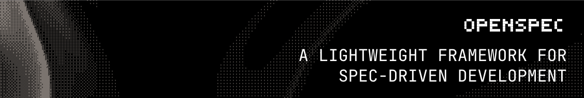

<p align="center">
  <a href="https://github.com/Fission-AI/OpenSpec">
    <picture>
      <source srcset="assets/openspec_bg.png">
      
    </picture>
  </a>
</p>

<p align="center">
  <strong>OpenSpec 中文版 - AI驱动的系统化开发规范管理</strong>
</p>
<p align="center">
  <strong>为AI编程助手提供规范驱动的开发流程，中文界面支持</strong>
</p>

<p align="center">
  <a href="https://github.com/org-hex/openspec-chinese/actions/workflows/ci.yml"></a>
  <a href="https://www.npmjs.com/package/@org-hex/openspec-chinese"></a>
  <a href="./LICENSE"></a>
  <a href="https://discord.gg/YctCnvvshC"></a>
</p>

<details>
<summary><strong>最受欢迎的规范框架</strong></summary>

[](https://github.com/Fission-AI/OpenSpec/stargazers)
[](https://www.npmjs.com/package/@fission-ai/openspec)
[](https://github.com/Fission-AI/OpenSpec/graphs/contributors)

</details>
<p></p>
我们的理念:

```text
→ 更流畅，不死板
→ 更迭代，不瀑布
→ 更容易，不复杂
→ 为存量项目而生，而不仅是新项目
→ 可从个人项目扩展到企业级
```

> [!TIP]
> **新工作流已上线！** 我们基于制品驱动的流程重构了 OpenSpec。
>
> 运行 `/opsx:onboard` 开始使用 → [了解更多](docs/opsx.md)

<p align="center">
  关注 <a href="https://x.com/0xTab">@0xTab</a> 获取更新 · 加入 <a href="https://discord.gg/YctCnvvshC">OpenSpec Discord</a> 交流与提问。
</p>

### 团队支持

团队使用 OpenSpec？[发邮件联系](mailto:teams@openspec.dev) 申请加入 Slack 频道。

<!-- TODO: Add GIF demo of /opsx:new → /opsx:archive workflow -->

## 一眼看懂

```text
你: /opsx:new add-dark-mode
AI:  已创建 openspec/changes/add-dark-mode/
     准备创建：proposal

你: /opsx:ff   # “fast-forward” - 一次性生成全部规划文档
AI:  ✓ proposal.md — 为什么做、改什么
     ✓ specs/       — 需求与场景
     ✓ design.md    — 技术方案
     ✓ tasks.md     — 实施清单
     准备开始实现！

你: /opsx:apply
AI:  正在实施任务...
     ✓ 1.1 添加主题上下文提供器
     ✓ 1.2 创建切换组件
     ✓ 2.1 添加 CSS 变量
     ✓ 2.2 接入 localStorage
     全部完成！

你: /opsx:archive
AI:  已归档至 openspec/changes/archive/2025-01-23-add-dark-mode/
     规范已更新。准备下一个特性。
```

<details>
<summary><strong>OpenSpec Dashboard</strong></summary>

<p align="center">
  
</p>

</details>

## 中文版说明

**OpenSpec 中文版** 基于 [Fission-AI/OpenSpec](https://github.com/Fission-AI/OpenSpec) 本地化，提供完整中文界面与模板。

### 与原版区别

| 特性 | 原版 OpenSpec | OpenSpec 中文版 |
|------|---------------|-----------------|
| 界面语言 | 英文 | 中文 |
| CLI命令 | `openspec` | `openspec-chinese` |
| 原始代码修改 | - | 零修改（完全兼容） |
| 中文模板 | - | ✅ 完整支持 |
| Gherkin关键字 | 英文 | 英文（保持兼容性） |

## 快速开始

**需要 Node.js 20.19.0 或更高版本。**

全局安装：

```bash
npm install -g @org-hex/openspec-chinese@latest
```

进入项目目录并初始化：

```bash
cd your-project
openspec-chinese init
```

现在告诉你的 AI：`/opsx:new <你想实现的功能>`

> [!NOTE]
> 不确定工具是否支持？[查看完整列表](docs/supported-tools.md) – 已支持 20+ 工具并持续增加。
>
> 同样支持 pnpm、yarn、bun 与 nix。 [查看安装选项](docs/installation.md)。

## 文档

**中文文档：**

→ **[中文版说明](docs/zh-CN/README.md)**：中文版本概览<br>
→ **[中文使用指南](docs/zh-CN/usage-guide.md)**：完整使用流程<br>
→ **[中文格式问题解决方案](docs/zh-CN/format-issues-solution.md)**：常见问题排查<br>

**英文文档：**

→ **[Getting Started](docs/getting-started.md)**：快速上手<br>
→ **[Workflows](docs/workflows.md)**：组合与流程<br>
→ **[Commands](docs/commands.md)**：斜杠命令与技能<br>
→ **[CLI](docs/cli.md)**：命令行参考<br>
→ **[Supported Tools](docs/supported-tools.md)**：工具与安装路径<br>
→ **[Concepts](docs/concepts.md)**：核心概念
→ **[Multi-Language](docs/multi-language.md)**：多语言支持<br>
→ **[Customization](docs/customization.md)**：自定义扩展

## 为什么选择 OpenSpec？

AI 编程助手很强大，但如果需求只存在于聊天记录里，结果往往不可控。OpenSpec 提供一层轻量规格，让你在写代码之前先对齐要做什么。

- **先对齐，再实现** — 人与 AI 在写代码前先对齐规格
- **结构化管理** — 每个变更独立目录，包含提案、规范、设计、任务
- **流畅迭代** — 任意阶段可更新产物，无需僵硬的阶段门
- **兼容多工具** — 通过斜杠命令支持 20+ AI 助手

### 对比

**对比 [Spec Kit](https://github.com/github/spec-kit)**（GitHub）— 完整但偏重，Markdown 量大、流程更刚性。OpenSpec 更轻量，适合快速迭代。

**对比 [Kiro](https://kiro.dev)**（AWS）— 强大但绑定 IDE 且模型受限。OpenSpec 适配你现有的工具链。

**对比“没有规范”** — 没有规格的 AI 编程容易跑偏。OpenSpec 帮你在保持灵活的同时提升确定性。

## 常用命令

### 1. 创建变更提案

```bash
# 方法1：CLI
openspec-chinese proposal "添加用户搜索功能"

# 方法2：AI 助手指令（支持的工具）
# Claude Code: /openspec:proposal 添加用户搜索功能
# Cursor: /openspec-proposal 添加用户搜索功能
# Cline: 在工作流中选择 "Create OpenSpec Proposal"
```

### 2. 查看与管理

```bash
openspec-chinese list
openspec-chinese show add-user-search
openspec-chinese validate add-user-search
openspec-chinese view
```

### 3. 实施与归档

```bash
# 让 AI 实施变更
# “请实施 add-user-search 变更”

# 归档完成的变更
openspec-chinese archive add-user-search --yes
```

## 支持的AI工具

### 原生支持（斜杠命令）

| 工具 | 命令格式 |
|------|----------|
| **Claude Code** | `/openspec:proposal`, `/openspec:apply`, `/openspec:archive` |
| **Cursor** | `/openspec-proposal`, `/openspec-apply`, `/openspec-archive` |
| **Cline** | 工作流支持 (`.clinerules/workflows/`) |
| **RooCode** | `/openspec-proposal`, `/openspec-apply`, `/openspec-archive` |
| **CodeBuddy** | `/openspec:proposal`, `/openspec:apply`, `/openspec:archive` |
| **GitHub Copilot** | `/openspec-proposal`, `/openspec-apply`, `/openspec-archive` |
| **Amazon Q Developer** | `@openspec-proposal`, `@openspec-apply`, `@openspec-archive` |

### AGENTS.md 兼容

所有支持 `AGENTS.md` 规范的AI工具都可以使用，包括：
- Amp、Jules 等其他工具

## 项目结构

```
your-project/
├── openspec/
│   ├── specs/              # 当前规范（当前事实）
│   │   └── feature/
│   │       └── spec.md
│   ├── changes/            # 变更提案（建议更新）
│   │   └── add-feature/
│   │       ├── proposal.md     # 变更提案
│   │       ├── tasks.md        # 实施任务
│   │       ├── design.md       # 技术设计（可选）
│   │       └── specs/          # 规范增量
│   │           └── feature/
│   │               └── spec.md
│   ├── project.md          # 项目上下文
│   └── AGENTS.md           # AI助手指令
```

## 规范格式示例

```markdown
## ADDED Requirements
### Requirement: 用户搜索功能
系统应当提供用户搜索功能，支持按姓名和邮箱搜索。

#### Scenario: 按姓名搜索用户
- **WHEN** 用户输入姓名并点击搜索
- **THEN** 系统返回匹配的用户列表

#### Scenario: 按邮箱搜索用户
- **WHEN** 用户输入邮箱并点击搜索
- **THEN** 系统返回匹配的用户信息

## MODIFIED Requirements
### Requirement: 用户列表页面
用户列表页面应当支持搜索过滤功能。

## REMOVED Requirements
### Requirement: 简单用户浏览
**Reason**: 功能已被新的搜索功能替代
**Migration**: 用户应使用新的搜索功能来查找用户
```

**重要提示：**
- `## ADDED|MODIFIED|REMOVED Requirements` 必须使用英文
- `#### Scenario:`、`**WHEN**`、`**THEN**` 等 Gherkin 关键字必须使用英文
- 描述性内容可以使用中文

## 高级用法

### 项目上下文配置

初始化后，填充项目上下文：

```text
请帮我完善 openspec/project.md 文件，包含以下信息：
- 项目技术栈
- 架构模式
- 编码规范
- 测试策略
- 部署流程
```

### 更新AI助手配置

```bash
openspec-chinese update
```

## 更新 OpenSpec 中文版

**升级包版本**

```bash
npm install -g @org-hex/openspec-chinese@latest
```

**刷新 AI 助手指令**

在每个项目内运行，重新生成指令与斜杠命令：

```bash
openspec-chinese update
```

## 使用建议

**模型选择**：OpenSpec 更适合高推理模型。我们建议 Opus 4.5 与 GPT 5.2 用于规划与实现。

**上下文卫生**：保持上下文清晰。开始实现前清理上下文，执行过程中保持简洁。

## 贡献

欢迎为 OpenSpec 中文版贡献代码：

```bash
# 安装依赖
pnpm install

# 构建
pnpm run build

# 测试
pnpm test
```

**小改动** — Bug 修复、拼写修正、细节优化可直接提 PR。

**大改动** — 新功能、重要重构或架构调整请先提交 OpenSpec 变更提案，确保目标对齐。

提交 PR 时请确保已测试。如果包含 AI 生成代码，请说明使用的工具与模型版本。

### 开发

- 安装依赖：`pnpm install`
- 构建：`pnpm run build`
- 测试：`pnpm test`
- 本地开发 CLI：`pnpm run dev` 或 `pnpm run dev:cli`
- 约定式提交（一行）：`type(scope): subject`

## 其他

<details>
<summary><strong>Telemetry</strong></summary>

OpenSpec 会收集匿名使用统计。

只收集命令名与版本，用于了解使用情况。不收集参数、路径、内容或 PII。在 CI 中会自动禁用。

**关闭方式：** `export OPENSPEC_TELEMETRY=0` 或 `export DO_NOT_TRACK=1`

</details>

<details>
<summary><strong>Maintainers & Advisors</strong></summary>

维护者与顾问列表见 [MAINTAINERS.md](MAINTAINERS.md)。

</details>

## License

MIT
